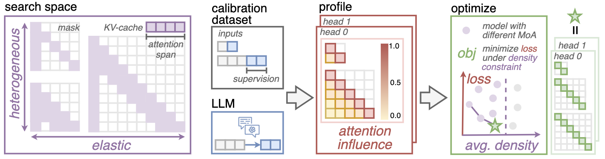

# MoA: Mixture of Sparse Attention for Automatic Large Language Model Compression



Mixture of Attention (MoA) overcomes the drawbacks of uniform sparse attention by searching heterogeneous elastic rules for each attention head using an automatic pipeline. 

MoA achieves a $1.2-1.4\times$ GPU memory reduction and boosts the maximum decode throughput by $5.5-6.7 \times$ for 7B and 13B dense models on a single GPU, with minimal impact on performance.

## Environment Setup

First, create and activate the Conda environment using the following commands:

```bash
conda create -n moa python=3.10.13
conda activate moa
pip install -r requirement.txt
pip install -e .
```

## Automatic Search Pipeline

The pipeline automatically compresses the LLM, beginning with the creation of a calibration dataset that includes long dependency and model alignment. This dataset is used for gradient-based profiling to assess the impact of each attention position on prediction loss. Following profiling, MoA optimizes sparse attention configurations for each model layer and attention head, aiming to minimize accuracy loss within specified density budgets.

### Calibration Dataset Generation

MoA creates the calibration dataset with long dependency and model alignment. 
This process involves querying an LLM with original questions to collect its responses, which are then formatted into a standard Hugging Face `Dataset` item.

```bash
python scripts/pipeline/generate_calibration_dataset.py --model_path lmsys/vicuna-7b-v1.5-16k --model_name vicuna-7b-v1.5-16k --output_path_base local/dataset
```

### Profile
MoA employs a gradient based method to quantify the importance of the attention values. The `--response_mask` option specifies that only the model's responses are used as supervision. Given the calibration dataset, the profile process outputs the average attention influence tensor at a specific sequence length.

```bash
python scripts/pipeline/pipeline_profile.py --model_name lmsys/vicuna-7b-v1.5-16k --max_length 2048 --response_mask --dataset_dir local/dataset/multi_conversation_model/vicuna-7b-v1.5-16k/multi_news --grad_dir 7b/profile_2k

python scripts/pipeline/pipeline_profile.py --model_name lmsys/vicuna-7b-v1.5-16k --max_length 4096 --response_mask --dataset_dir local/dataset/multi_conversation_model/vicuna-7b-v1.5-16k/multi_news --grad_dir 7b/profile_4k

python scripts/pipeline/pipeline_profile.py --model_name lmsys/vicuna-7b-v1.5-16k --max_length 8192 --response_mask --dataset_dir local/dataset/multi_conversation_model/vicuna-7b-v1.5-16k/multi_news --grad_dir 7b/profile_8k
```

### Optimize

MoA identifies Pareto front compression plans to  minimize accuracy losses across various sequence lengths under density budget. The `--elastic_length` option specifies the sequence lengths for which profile are done, `--extend_length` determines the maximum length which we wish the compression plan to extend to, and `--density_bounds` sets the maximum allowable attention density for each length.

```bash
python scripts/pipeline/elastic_generate.py --output_dir 7b/lut_result --elastic_length 2048 4096 8192 --extend_length 16384 --density_bounds 0.5 0.5 0.5 0.5 --importance_tensor_dir 7b/ --output_length 4096 8192 12288 16384
```

You can set `--time_limit num` to specify the maximum duration (in seconds) for each single objective optimization. Also you might need to apply for the gurobi license on the [official website](https://www.gurobi.com/) to use the optimization library.

### Validate

MoA selects the plan that yields minimum loss at unseen length among the Pareto front plans.

To evaluate the loss of a certain plan on a specified length level, use the following command, replacing `{i}` with the actual plan ID:

```bash
CUDA_VISIBLE_DEVICES=0 python scripts/pipeline/perplexity_evaluate.py --model_name lmsys/vicuna-7b-v1.5-16k --max_length 12288 --dataset_dir nics-efc/MoA_Long_HumanQA --split valid --response_mask --lut_path 7b/lut_result/lut_12288_plan_{i}.pt  --result_path validation_test.csv 
```

Alternatively, to evaluate all plans within a directory, run the following script:

```
scripts/pipeline/validate.sh 7b/lut_result <plan_num> 7b/validate_result /lmsys/vicuna-7b-v1.5-16k
```

Replace <plan_num> with the number of plans under the directory.

## Evaluation

### Apply MoA to LLM

Given the compression plan found by MoA, you can simply apply the plan to the model with few lines. 

```python
from transformers import AutoModelForCausalLM
from MoA.models.interface import update_model_function
from MoA.attention.set import set_static_attention_lut

# Load the huggingface model
model_name = "lmsys/vicuna-7b-v1.5-16k"
model = AutoModelForCausalLM.from_pretrained(model_name)
tokenizer = AutoTokenizer.from_pretrained(model_name)

# Add sparse attention capability to the model by modifying the forward function
model = update_model_function(model, model_name)
model.model.use_block_sparse_attention_lut(permute_head=True, sparse_decode=True)

# Load the plan at a specific length to the model
set_static_attention_lut(path_to_lut, model_layers=model.model.layers, permute_head=True, sparse_decode=True)

# Now you can use the `model` for efficient inference like any regular huggingface model
# For example, you can use it in pipeline to chat with the model
pipe = pipeline(task="text-generation", tokenizer=tokenizer, model=model, trust_remote_code=True)
prompt = "Hi."
output = pipe(prompt)
```

### Retrieval

MoA aims to preserve the retrieval ability of the original dense model with a reduced impact on accuracy. To evaluate the retrieval performance of a specific plan at a given input length, use the following command, replacing `{i}` with the actual plan ID:

```bash
CUDA_VISIBLE_DEVICES=0 python scripts/pipeline/retrieval_evaluate.py --model_name lmsys/vicuna-7b-v1.5-16k --lut_path 7b/lut_result/lut_8192_plan_{i}.pt --output_dir 7b/retrieval_8k --length_level 8
```

### LongBench

MoA strives to maintain the long-context understanding ability of the original dense model. To assess this capability using the [LongBench benchmark](https://github.com/THUDM/LongBench), execute the following command, substituting `{i}` with the actual plan ID:


```bash
CUDA_VISIBLE_DEVICES=0 python scripts/pipeline/longbench_evaluate.py --model_name lmsys/vicuna-7b-v1.5-16k --max_length 3500 --eval longbench_fast --longbench_e --longbench_result_dir 7b/longbench_result --longbench_length_range 0-4k --use_lut --lut_path 7b/lut_result/lut_4096_plan_{i}.pt

CUDA_VISIBLE_DEVICES=0 python scripts/pipeline/longbench_evaluate.py --model_name lmsys/vicuna-7b-v1.5-16k --max_length 7500 --eval longbench_fast --longbench_e --longbench_result_dir 7b/longbench_result --longbench_length_range 4-8k --use_lut --lut_path 7b/lut_result/lut_8192_plan_{i}.pt

CUDA_VISIBLE_DEVICES=0 python scripts/pipeline/longbench_evaluate.py --model_name lmsys/vicuna-7b-v1.5-16k --max_length 15500 --eval longbench_fast --longbench_e --longbench_result_dir 7b/longbench_result --longbench_length_range 8k+ --use_lut --lut_path 7b/lut_result/lut_16384_plan_{i}.pt
```

